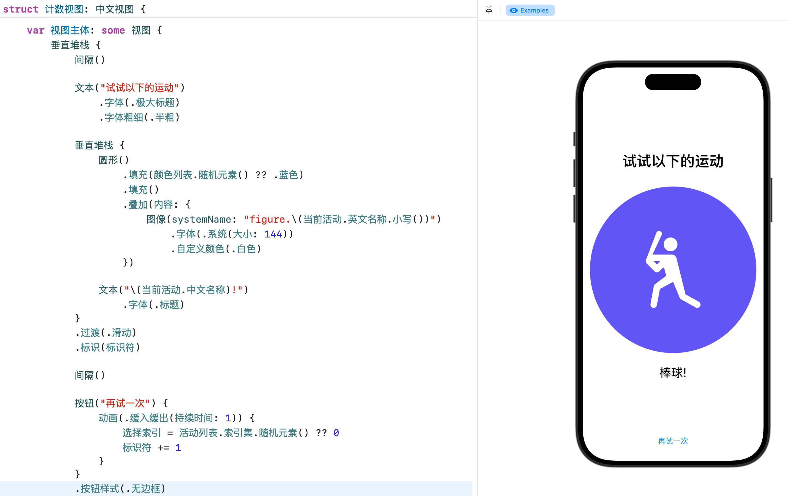

# NNESwift – Swift for Non-Native English Speakers



Write SwiftUI code in the language you are comfortable in. 

```swift
垂直堆栈 {
    圆形()
        .填充(颜色列表.随机元素() ?? .蓝色)
        .填充()
        .叠加(内容: {
            图像(systemName: "figure.\(当前活动.英文名称.小写())")
                .字体(.系统(大小: 144))
                .自定义颜色(.白色)
        })

    文本("\(当前活动.中文名称)!")
        .字体(.标题)
}
```

Compiles to be exactly the same as normal Swift:

```
VStack {
    Circle()
        .fill(colors.randomElement() ?? .blue)
        .padding()
        .overlay(
            Image(systemName: "figure.\(selected.lowercased())")
                .font(.system(size: 144))
                .foregroundColor(.white)
        )
    
    Text("\(selected)!")
        .font(.title)
}
```

See `Sources/NonEnglishSwiftChinese/Examples.swift` for a full example.

<details>
  <summary><strong>Quick Explanations for English Speakers</strong></summary>
  
Have you ever imagined Swift code looking like this?

Spanish
```swift
PilaVertical {
    Circulo()
        .rellenar(paleta.elementoAleatorio() ?? .azul)
        .relleno()
        .superponer {
            Imagen(systemName: "figure.\(actividadActual.nombreIngles.minusculas())")
                .fuente(.sistema(tamano: 144))
                .colorDePrimerPlano(.blanco)
        }

    Texto("\(actividadActual.nombreEspañol)!")
        .fuente(.titulo)
}
```

What if I tell you this is just

```swift
VStack {
    Circle()
        .fill(colors.randomElement() ?? .blue)
        .padding()
        .overlay(
            Image(systemName: "figure.\(selected.lowercased())")
                .font(.system(size: 144))
                .foregroundColor(.white)
        )
    
    Text("\(selected)!")
        .font(.title)
}
```

Not so fun to read even if you know some Spanish, right? This is the difficult reality facing Non-Native English Speaker (NNES) developers everyday.
</details>

## Quick Start
You can add **NNESwift** to any SwiftUI project using **Swift Package Manager (SPM)**.

### **1. Add the package in Xcode**

1. Open your project in **Xcode**
2. Go to **File → Add Packages…**
3. Enter the NNESwift repository URL:

```
https://github.com/voilatekku/NNESwift
```

4. Select the package products you want (e.g., `NonEnglishSwiftChinese`)
5. Add the package to your app target

---

### **2. Import the localized module**

```swift
import NonEnglishSwiftChinese
import SwiftUI
```

---

### **3. Start writing SwiftUI in your language**

That’s it — Xcode will resolve and build the package automatically.
You can now mix localized identifiers with normal SwiftUI whenever you want.

Introducing **NNESwift** (Non-Native English Speaker Swift), an experimental Swift package that lets you write SwiftUI code using the natural language you’re most comfortable with — starting with Chinese, with more languages (like Japanese) planned.

Programming should be hard because of *logic*, not because of *English*.

---

## Motivation

### English is the default programming language

For decades, computer scientists have tried to make programming languages “more like natural language”. In practice, *natural language* has almost always meant **English**. This is usually a minor issue for the essential keywords like `if`, `while` and `await`, but modern programming in a scale larger than a toy project will involve working with

- Standard library and API names (`VStack`, `NavigationSplitView`, `NSAttributedString`)
- Documentation, tutorials, Stack Overflow answers, error messages

Becker notes that nearly all popular programming languages are designed around English keywords and that most documentation and community resources are also in English, which likely puts non-native English speakers at a disadvantage when reading and writing code, debugging, and learning new concepts.:contentReference[oaicite:0]{index=0}  

### Non-native English speakers face extra barriers

A large CHI study surveying 840 learners from 86 countries found that non-native English speakers struggle with:​:contentReference[oaicite:1]{index=1}  

- Reading instructional materials and documentation  
- Technical communication (listening, speaking, writing)  
- Reading *and* writing code, especially when identifiers and comments are in English  
- Simultaneously learning English and programming

Participants explicitly asked for:

- Fewer idioms, slang, and culture-specific jokes in teaching materials  
- More visual/multimedia explanations  
- Inline dictionaries and tools that help them understand identifiers and error messages in context  

A 2025 study of Japanese university students learning Python shows similar patterns: non-native English speakers frequently report that vocabulary and grammar in English-centric resources slow down their progress in introductory programming courses.:contentReference[oaicite:2]{index=2}  

In other words: **even when you understand the algorithm, English can still be the bottleneck.**

### APIs, identifiers, and “developer English”

Research on identifiers and program comprehension shows that:​:contentReference[oaicite:3]{index=3}  

- Identifiers (variable/method/class names) make up around a third of code tokens and about two-thirds of the characters.
- Meaningful, full-word identifiers and well-constructed abbreviations significantly improve comprehension and recall.
- Poorly named or opaque identifiers increase cognitive load and slow down understanding.

For non-native English speakers (NNES), many API names are a mix of:

- English words that are uncommon in everyday speech (“declarative”, “affine”, “affordance”)
- Jargon or idioms (“snapping behavior”, “becomeFirstResponder”)
- Acronyms and abbreviations (“AsyncStream”, “NSAttributedString”, `getch`)

Guo et al. report that NNES learners specifically struggle with deciphering abbreviated or idiomatic identifiers and with the mismatch between colloquial English meaning and formal programming semantics.:contentReference[oaicite:4]{index=4}  

### The SwiftUI pain point

Swift and SwiftUI are beautiful, expressive, and strongly tied to English:

- `NavigationSplitView`, `DisclosureGroup`, `transaction(_:)`, `task(priority:_:)`, `onSubmit(of:_:)`, etc.
- Long chained method names whose *English phrasing* encodes subtle meaning.

For a non-native English speaker, reading a long SwiftUI view body often means:

1. Mentally parsing unfamiliar English phrases,
2. Matching each part to SwiftUI behavior,
3. Doing all of that *before* thinking about app logic or layout.

From a personal NNES perspective: **scanning long SwiftUI method chains is slow and error-prone**. It’s easy to miss one modifier or misinterpret a name — not because the logic is complicated, but because the English is.

### AI has lowered the barrier to coding — but not the language barrier

Code-generation tools and large language models (LLMs) make it easier than ever to start coding without a formal CS background. But they’re trained primarily on English-centric data and code:​:contentReference[oaicite:5]{index=5}  

- English is still the dominant language of online technical content.
- Many tools assume English prompts and English identifiers.
- NNES users may still need to “translate twice”: from their native language → English prompt → English code.

If AI has reduced the *technical* and *financial* cost of learning to code, the next step is reducing the **English tax**.

---

## Vision

> **Write Swift in the language you think in.**

**NNESwift** is an open-source experiment in **localized programming interfaces**:

- We keep **standard Swift and SwiftUI** as the underlying language.
- We add **localized, human-readable wrappers** so you can write code using Chinese (and later Spanish, Japanese, etc.).
- We aim for a **1:1 mapping** between localized API names and their original Swift equivalents so you never lose the bridge to the wider ecosystem.

The goal is *not* to fragment Swift or replace English APIs. The goal is to:

- Make SwiftUI more approachable for NNES learners and professionals.
- Let people prototype, explore, and think in their native language.
- Provide smoother on-ramps to English-centric documentation and community resources.

---

## What NNESwift does

- ✅ **Localized SwiftUI layer**  
  A set of Swift modules that expose SwiftUI types and modifiers under localized names (starting with Simplified Chinese).

- ✅ **Pure Swift, fully interoperable**  
  Under the hood we still import `SwiftUI` and forward everything. All code compiles to standard Swift and works with existing tooling.

- ✅ **Unicode-friendly identifiers**  
  Swift already supports Unicode identifiers. NNESwift embraces this: type names, variables, and functions can all use non-Latin scripts.

- ✅ **Mix-and-match usage**  
  Use localized APIs where it helps you think more clearly, and fall back to original SwiftUI names whenever you prefer.

- ✅ **Learnable, discoverable mappings**  
  Our naming style aims to be:
  - **Literal enough** to map back to the original API,
  - **Natural enough** to feel intuitive in the target language.


## Roadmap

This is a **meaningful and ambitious** long-term project. Some directions we’re exploring:

### 1. API coverage

* ✅ Core SwiftUI layout primitives (VStack, HStack, ZStack, etc.)
* ✅ Basic view and modifier names
* ⏳ Navigation, animations, accessibility, gestures
* ⏳ Common Foundation / Combine types where it helps NNES learners

### 2. More languages

* 🇨🇳 Simplified Chinese (first target)
* 🇪🇸 Spanish (example language for native Spanish speakers)
* 🇯🇵 Japanese
* 🇰🇷 Korean
* 🇸🇦 Arabic
* …and others, depending on community interest and native-speaker maintainers

### 3. Tooling & editor support

* An Xcode Source Editor Extension or LSP plugin that:

  * Shows the original English SwiftUI name on hover.
  * Allows quick switching between localized and English identifiers.
* Code actions to “translate this identifier to English” (and back) inline.

### 4. AI-assisted workflows

Since many people now learn with AI coding assistants:

* Prompt templates for asking LLMs to *explain* localized APIs and map them back to official SwiftUI documentation.
* Experiments on how localized identifiers affect NNES understanding of AI-generated code.

### 5. Research & evaluation

We would love to treat NNESwift as a platform for empirical studies, for example:

* Do beginners using localized SwiftUI learn layout and state concepts faster?
* How does localized naming affect retention and confidence?
* Do learners transition more smoothly to English-only code bases?

If you’re a computing education researcher or instructor working with NNES students, please reach out.

---

## Contributing

We welcome contributions from:

* Native speakers who can help refine terminology.
* Swift developers who care about accessibility and education.
* Educators and researchers working with NNES learners.

### How to help

* **File issues** for confusing names, missing APIs, or suggestions.
* **Open PRs** adding or improving localized wrappers.
* **Share teaching materials** (slides, exercises, demo projects) that use NNESwift.
* **Run studies** or classroom trials and share your findings.

Basic contribution steps:

1. Fork the repository.
2. Create a feature branch.
3. Add tests or sample code where appropriate.
4. Open a PR with:

   * Clear description of changes,
   * Language notes (why this translation / term),
   * Any links to dictionaries, glossaries, or style guides you used.

---

## FAQ

### Will this stop people from learning English?

We don’t think so. Almost all documentation, conference talks, and library code are still in English — and that will remain true for a long time.

NNESwift is meant to:

* **Lower the entry barrier** so people can start building and thinking in code sooner.
* **Serve as a bridge** between native-language thinking and English-dominated ecosystems.
* **Empower educators** to focus early teaching on concepts, not vocabulary memorization.

### Why not just use English identifiers and rely on comments?

Comments help, but research shows that **identifier names matter a lot** for comprehension and memory.([Hebrew University Computer Science][1])

Having both localized identifiers *and* comments gives NNES learners more hooks for understanding code.

### Haven’t localized programming languages failed before?

Yes, there have been many attempts to create non-English programming languages or fully translated APIs, and most did not gain wide adoption.([pg.ucsd.edu][2])

NNESwift tries a different approach:

* It doesn’t create a new language; it wraps **existing SwiftUI**.
* The original English names are always just one step away.
* It focuses on a specific, well-defined domain (SwiftUI UI code) instead of trying to localize everything.

---

## License

This project is open source. See the `LICENSE` file in this repository for details.

---

## Acknowledgements & further reading

If you’re interested in the research that inspired NNESwift, here are some starting points:

* Brett A. Becker. *Barriers to Programming Language Acquisition for Non-Native English Speakers* (PPIG, 2019).([ppig.org][3])
* Philip J. Guo et al. *Non-Native English Speakers Learning Computer Programming: Barriers, Desires, and Design Opportunities* (CHI, 2018).([ACM Digital Library][4])
* D. Lawrie et al., and E. Avidan & Dror Feitelson. Work on how identifier naming affects comprehension and memory.([Hebrew University Computer Science][1])
* Studies on localized versions of Scratch showing that learners using their native language interfaces learn programming concepts faster.([pg.ucsd.edu][2])
* Personal accounts and essays on language barriers in coding, for example “Barriers in Coding for Non-Native English Speakers”.([DEV Community][5])

NNESwift stands on the shoulders of this work and aims to be a practical, open-source playground for making programming more inclusive for the 95% of the world who are not native English speakers.([pg.ucsd.edu][2])


[1]: https://www.cs.huji.ac.il/~feit/papers/Names17ICPC.pdf?utm_source=chatgpt.com "Effects of Variable Names on Comprehension"
[2]: https://pg.ucsd.edu/publications/non-native-english-speakers-learning-programming_CHI-2018.pdf "paper"
[3]: https://www.ppig.org/files/2019-PPIG-30th-becker.pdf?utm_source=chatgpt.com "Barriers to Programming Language Acquisition for Non- ..."
[4]: https://dl.acm.org/doi/10.1145/3173574.3173970?utm_source=chatgpt.com "Non-Native English Speakers Learning Computer ..."
[5]: https://dev.to/knheidorn/barriers-in-coding-for-non-native-english-speakers-2c65?utm_source=chatgpt.com "Barriers in Coding for Non-Native English Speakers"
